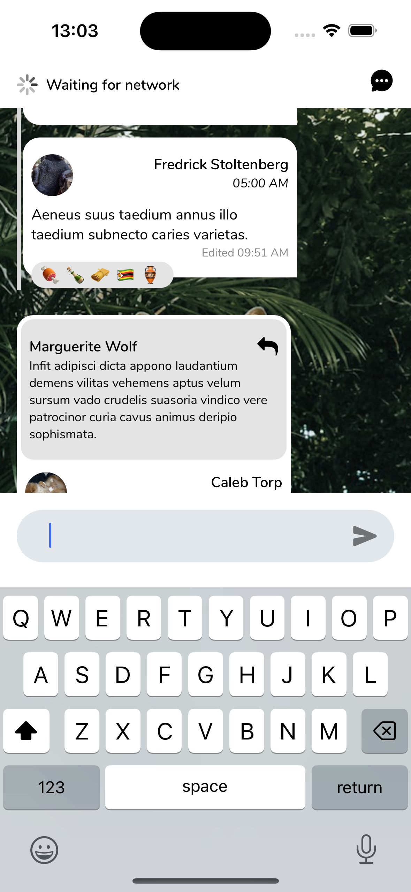

# Tribe Chat

## Overview

**Tribe Chat** is a cross-platform single-room chat application built with React Native and Expo. The app demonstrates a robust chat experience, including grouped messages, reactions, quoted replies, and offline support.

---

## ScreenShots

[Watch the Demo Video](https://drive.google.com/file/d/1fnW505nl1JDa-rsBOOYFE8iRNuW8tjCS/view?usp=sharing)

## 

## Features

### ✅ **Required Features**

- **Message List**:
  - Displays all chat messages with:
    - Participant's **avatar** and **name**.
    - **Timestamp** showing when the message was sent.
    - **Edited** indicator for modified messages.
    - Row of **reactions** below messages with reactions.
  - **Image attachments** are displayed in messages.
  - Consecutive messages from the same participant are **grouped together**.
- **Message Input**:
  - Input bar at the bottom for **sending new messages**. Sending the message make a request and update the message list

---

### ⭐ **Good-to-Have Features**

In addition to the required features, the app implements the following enhancements:

- **Quoted Replies**:
  - Messages sent as replies display the original message context.
- **Efficient API Usage**:
  - Uses API endpoints to hydrate the app on launch and sync updates efficiently
- **Lazy Loading**:
  - Implements infinite scroll for loading older messages. [FlashList was utilized ](https://shopify.github.io/flash-list/docs/)
- **Offline Support**:
  - Fetched data is stored locally for offline access using [Zustand persist](https://zustand.docs.pmnd.rs/integrations/persisting-store-data) and [Async-storage](https://www.npmjs.com/package/@react-native-async-storage/async-storage) .
- **Performance Optimizations**:
  - Minimizes unnecessary re-renders to ensure a smooth user experience.
- **Reactions**:
  - Clicking on reactions shows a bottom sheet with details (emoji + participant names).
- **Participant Details**:
  - Clicking on a participant’s name or avatar opens a bottom sheet with their information.
- **Image Preview**:
  - Clicking on a message’s image opens a modal with an image preview.
- **@Mentions**:
  - Supports mentioning participants in messages.
